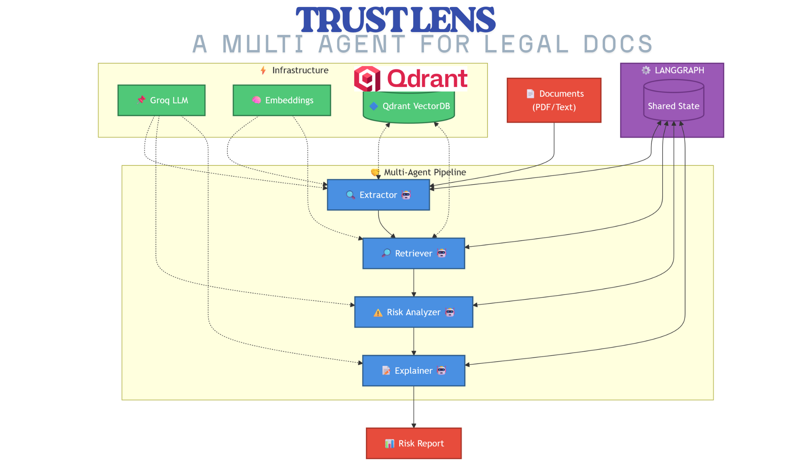

# TrustLens 📝👓

A multi-agent, retrieval-based AI system powered by **Qdrant** that detects clause drift, hidden risk escalation, and policy contradictions across contract versions. TrustLens uses long-term semantic memory and evidence-grounded reasoning to surface what changed, why it matters, and where the evidence comes from.

---

## 🎯 Overview

TrustLens leverages a sophisticated multi-agent architecture built with **LangGraph** to analyze legal documents comprehensively:

- **Clause Drift Detection**: Identifies modifications in contract clauses across versions
- **Risk Escalation Analysis**: Uncovers hidden changes that may increase liability or obligations
- **Policy Contradiction Detection**: Surfaces conflicting terms within and across documents
- **Semantic Memory**: Uses Qdrant vector database for efficient clause retrieval and similarity matching
- **Evidence-Grounded Explanations**: Provides clear explanations of detected changes with supporting evidence

---


### Technology Stack

| Component | Technology | Purpose |
|-----------|-----------|---------|
| Orchestration | LangGraph | Graph-based workflow management |
| Embeddings | Sentence-Transformers | Semantic vector generation |
| Vector DB |  **QDRANT**   | Persistent vector storage & search |
| LLM | Groq (GPT-4) | Risk analysis & reasoning |
| Parsing | PyPDF2 | Document extraction |
| Framework | LangChain  | LLM integrations & utilities |

---


## 🎓 Use Cases

1. **Contract Review**: Automated detection of changes between contract versions
2. **Risk Assessment**: Identify high-risk modifications before signing
3. **Compliance Monitoring**: Track policy changes across documents
4. **Legal Intelligence**: Build semantic search over contract databases
5. **Document Auditing**: Detect contradictions and inconsistencies

---
## 📊 Project Structure

```
trustlens/
├── main.py                      # LangGraph pipeline orchestrator
├── setup_qdrant.py              # Qdrant initialization script
├── requirements.txt             # Python dependencies
│
├── AGENTS/                      # Specialized analysis agents
│   ├── __init__.py
│   ├── extractor.py             
│   ├── retriever.py          
│   ├── risk_analyzer.py       
│   └── explainer.py           
│
├── SERVICES/                    # Core services
│   ├── __init__.py
│   ├── document_parser.py     
│   ├── embeddings.py           
│   └── vector_store.py          
│
├── UTILS/                       # Utilities
│   ├── __init__.py
│   └── prompts.py               
│
└── data/                        # Sample documents
    ├── contract_v1.pdf
    ├── internal_policy.pdf
    └── contract_v2.pdf
```
## 🏗️ Architecture

### System Overview

TrustLens is built on a **modular, multi-agent architecture** orchestrated by LangGraph. The system follows a graph-based state machine pattern where each node represents a specialized agent responsible for a specific aspect of legal document analysis.

#### Architecture Diagram


<p align="center">
 
</p>

### Multi-Agent Pipeline

TrustLens implements a **LangGraph-based state machine** with seven specialized agents organized into three processing layers:

```
INPUT LAYER (State Initialization)
    ↓
PROCESSING PIPELINE (Sequential Agent Execution)
    ├─ Service Layer (Parsing, Embeddings, Storage)
    ├─ Analysis Layer (Extraction, Drift Detection)
    └─ Intelligence Layer (Risk Analysis, Explanation)
    ↓
OUTPUT LAYER (Results Aggregation)
```

---
## 🚀 Getting Started

### Prerequisites

- **Python 3.9+**
- **Qdrant Server** running at `http://localhost:6333`
- **Groq API Key** for LLM access

### Installation

1. **Clone the repository**
   ```bash
   git clone https://github.com/yourusername/trustlens.git
   cd trustlens
   ```

2. **Set up Python environment**
   ```bash
   conda create -n trustlens python=3.11
   conda activate trustlens
   ```

3. **Install dependencies**
   ```bash
   pip install -r requirements.txt
   ```

4. **Configure environment variables**
   ```bash
   cp .env.example .env
   # Edit .env with your Groq API key
   echo "GROQ_API_KEY=your_groq_api_key_here" >> .env
   ```

5. **Start Qdrant Server**
   ```bash
   docker run -p 6333:6333 qdrant/qdrant:latest
   ```

6. **Initialize Qdrant collections**
   ```bash
   python setup_qdrant.py
   ```


---


## 🔧 Configuration

### Environment Variables

```bash
# .env file
GROQ_API_KEY=your_api_key_here
QDRANT_URL=http://localhost:6333
EMBEDDING_MODEL = "all-MiniLM-L6-v2"
```
## 💻 Usage


### Running the Pipeline

```bash
# Execute full analysis
python main.py
```
---


### Qdrant Collection Schema

```
Collection: legal_docs
- Vector Size: 384 dimensions
- Distance Metric: COSINE
- Payload Fields:
  - clause_id (string): Unique clause identifier
  - text (string): Clause content
  - section_type (string): Document section
  - doc_id (string): Parent document ID
  - version (string): Document version
  - doc_type (string): Contract type
```

---

## 📈 Example Output

```json
{
  "clause_id": "vendor_contract_001_2.0_5",
  "type": "modified",
  "old": {
    "text": "Vendor may terminate this agreement with 30 days notice.",
    "version": "1.0"
  },
  "new": {
    "text": "Vendor shall terminate this agreement with 90 days notice.",
    "version": "2.0"
  },
  "risk": "High",
  "explanation": "Term extended from 30 to 90 days. Changed 'may' to 'shall' (mandatory obligation). Increases buyer's risk exposure by 2 months of service dependency.",
  "evidence": [
    "Modified termination clause",
    "Changed modal verb from 'may' (optional) to 'shall' (mandatory)"
  ]
}
```
### State Management & Data Flow

#### **LangGraph State Structure**

```python
state_schema = {
    "doc_path": str,              # Input: Document file path
    "metadata": dict,             # Input: Version, ID, type info
    "blocks": list,               # Parse → Extract
    "clauses": list,              # Extract → Embed
    "events": list,               # Drift → Risk → Explain
    "output": list                # Final results
}
```

#### **Graph Execution Flow**

```
START
  ↓
[1. Parse Node]           state["blocks"] = parse_node(state)
  ↓
[2. Extract Node]         state["clauses"] = extract_node(state)
  ↓
[3. Memory Node]          state["vectors"] = memory_node(state)
  ↓
[4. Drift Node]           state["events"] = drift_node(state)
  ↓
[5. Risk Node]            state["events"] = risk_node(state)
  ↓
[6. Explain Node]         state["output"] = explain_node(state)
  ↓
END
```

**State Transitions**:
- Each node receives full state, returns updates
- LangGraph merges updates back to state
- Failed nodes trigger fallbacks/logging
- All state persisted for audit trail

---


## 🔍 Advanced Features

### Semantic Search
Query the vector store for similar clauses:
```python
from SERVICES.vector_store import client

# Find similar clauses
search_results = client.search(
    collection_name="legal_docs",
    query_vector=query_embedding,
    limit=10
)
```

### Filtered Retrieval
Retrieve clauses by metadata:
```python
from qdrant_client.models import Filter, FieldCondition, MatchValue

results = client.search(
    collection_name="legal_docs",
    query_vector=query_embedding,
    query_filter=Filter(
        must=[
            FieldCondition(key="doc_type", match=MatchValue(value="vendor_agreement")),
            FieldCondition(key="version", match=MatchValue(value="2.0"))
        ]
    )
)
```

---

## 🐛 Troubleshooting

### Qdrant Connection Error
```
[-] Qdrant unavailable: Connection refused. Running in memory mode.
```
**Solution**: Ensure Qdrant is running:
```bash
docker run -p 6333:6333 qdrant/qdrant:latest
```

### LLM Initialization Failed
```
[-] LLM initialization failed: API key not found
```
**Solution**: Set GROQ_API_KEY in .env file

### Vector Dimension Mismatch
Ensure all embeddings use the same model (all-MiniLM-L6-v2, 384-dim)

---

## 📝 License

This project is licensed under the MIT License. See [LICENSE](LICENSE) for details.

---

## 🤝 Contributing

Contributions are welcome! Please:

1. Fork the repository
2. Create a feature branch (`git checkout -b feature/amazing-feature`)
3. Commit changes (`git commit -m 'Add amazing feature'`)
4. Push to branch (`git push origin feature/amazing-feature`)
5. Open a Pull Request

---

## 📧 Support

For issues, questions, or suggestions, please open an issue on GitHub or contact the development team.

---

## 🔗 Related Technologies

- **[LangGraph](https://langchain-ai.github.io/langgraph/)**: Multi-agent orchestration
- **[Qdrant](https://qdrant.tech/)**: Vector database
- **[Sentence Transformers](https://www.sbert.net/)**: Semantic embeddings
- **[Groq](https://groq.com/)**: Fast LLM inference
- **[LangChain](https://www.langchain.com/)**: LLM framework

---

**Built with ❤️ for legal AI professionals**
